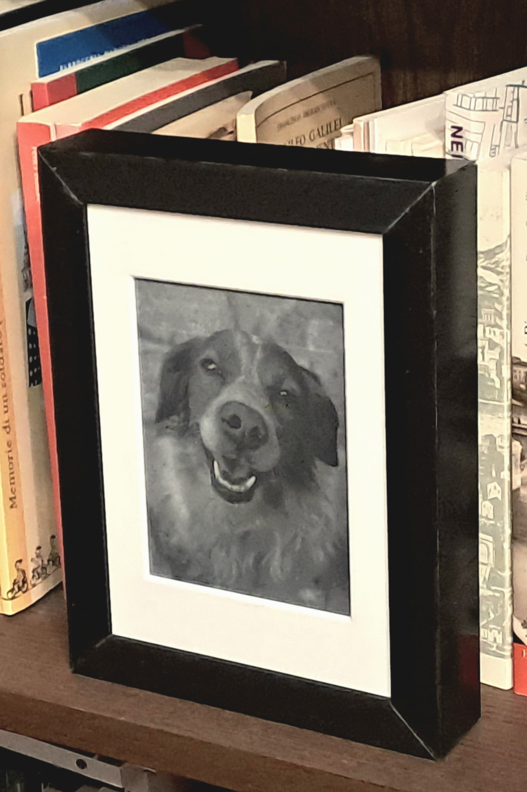
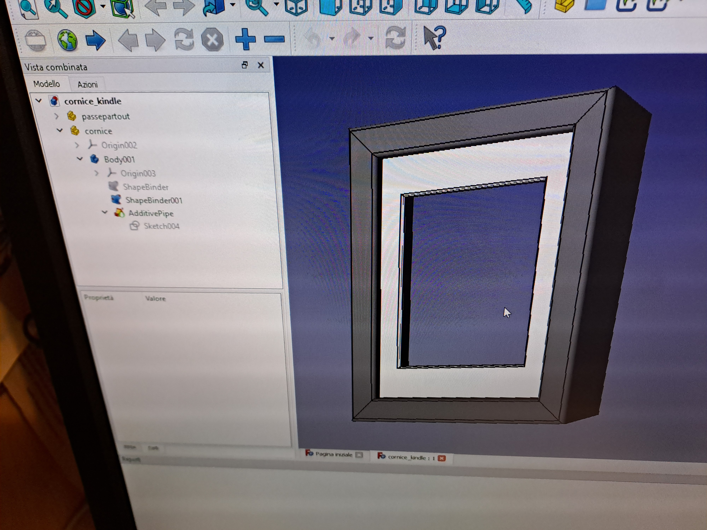

# Kindle Photoframe

[*Andrea Esuli*](https://esuli.it)



I have implemented a Photoframe function for my Kindle 4 (also known as the no touch version):
* Shows a random picture from those stored in a directory on the Kindle.
* Changes the picture at a given time interval, without manual intervention.
* Works with jpeg and png images, no image preprocessing required.

One goal was the maximization of the battery life:
* No active wifi connection is required. 
* Kindle wakes up automatically only to change the picture it shows, otherwise it stays in deep sleep.

## DISCLAIMER

Please note that this repository is for informational purposes only.
I take no responsibility for any broken/bricked devices if you try to replicate the activity reported here. 
If you choose to jailbreak your devices and install custom software on them it is your sole responsibility for any damages caused which are but not limited to, restricted access to cloud services, device instability, voiding warranties, and device inoperability. 
If you replicate any of the actions reported in this repository you are doing it at your own risk.

## Installation

### Jailbreak

Running a photoframe software on the the Kindle required to jailbreak it (please read the [DISCLAIMER](#DISCLAIMER) again) and ssh access. I followed [the steps reported here](https://gist.github.com/estysdesu/c90478aac75b732820be6720254aeda7), which are mainly based on [this wiki page](https://wiki.mobileread.com/wiki/Kindle4NTHacking). The part on recovering the root password using [this website](https://www.sven.de/kindle/) was a key information the get ssh/scp access to the device.

### FBInk

The key element of the photoframe is [NiLuJe's FBInk tool](https://github.com/NiLuJe/FBInk), which is able to show almost any image on the eink display. Great work!

I [downloaded the FBInk binaries for Kindle here](https://www.mobileread.com/forums/showthread.php?t=299620). 
Using scp I created a `fbink` subdirectory in the `/mnt/us/` directory on the Kindle.
I copied the content of the zip file in that `fbink` directory.
From a ssh console I created a symlink to the executables in the `/usr/local/bin` directory:

```
> cd /usr/local/bin
> mntroot rw
> ln -s /mnt/us/fbink/K3/bin/fbink fbink
> ln -s /mnt/us/fbink/K3/bin/fbdepth fbdepth
> mntroot ro
```

### Photoframe scripts

The photoframe application is just a bunch of shell scripts that:
* listens for the "going to sleep" event
* selects a random picture from the `picture` folder
* shows it using FBInk
* sets a RTC wakeup using for a given time interval

Whenever the Kindle wakes up, the script checks if it is caused by the RTC or not:
* if so, it triggers a picture update following the steps listed before
* if not, it means that the wakeup come from a human action and no action is taken

I copied the [photoframe](`photoframe`) directory of this repository in the `/mnt/us` directory of the Kindle.

### Picture folder

I created a `picture` folder in the `/mnt/us/documents` directory:

```
> cd /mnt/us/documents
> mkdir pictures
```

The pictures to be shown by Photoframe must be put here.

FBInk is able to show most of jpeg and png images. 
No preprocessing is required, yet I scale down large images to have a longer side of 800 pixel, to reduce the time required to load the image.

Note that the path `/mnt/us/documents` corresponds to the root directory of the Kindle drive shown when connecting it to the computer. 
I load and delete pictures using the USB connection.

Any change made to the content of the `picture` directory is effective at the next picture update, as the script checks the content of the directory every time it changes the picture.

### Update frequency

The time interval of update is stored it in the [`photoframe/delay.txt`](photoframe/delay.txt) file.
It is a plain text file with the value is expressed in seconds.

### Logging

I defined a minimal logging, that is enabled by deleting the [`photoframe/NO_LOGGING`](photoframe/NO_LOGGING) file.
Relevant events are logged in [`photoframe/photoframe.log`](photoframe/photoframe.log).
I create an empty `photoframe/NO_LOGGING` file to disable logging.

### Running

From a ssh console, I start the `photoframe.sh` script in background:

```
> cd /mnt/us/photoframe
> photoframe.sh &
> exit
```

Now whenever the Kindle goes to sleep it shows a random picture from the ones in the `picture` directory, and it changes them with the frequency stated in the `delay.txt` file.

## 3D-printed frame




I modeled a frame for the Kindle, then 3D-printed and glued it.

It blends very well with the other "real" frames on my wall.

[STL files to be printed](stl)

## License

[License](COPYING)